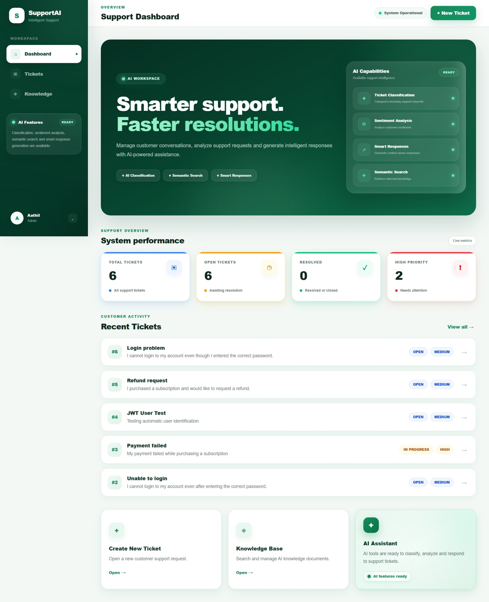
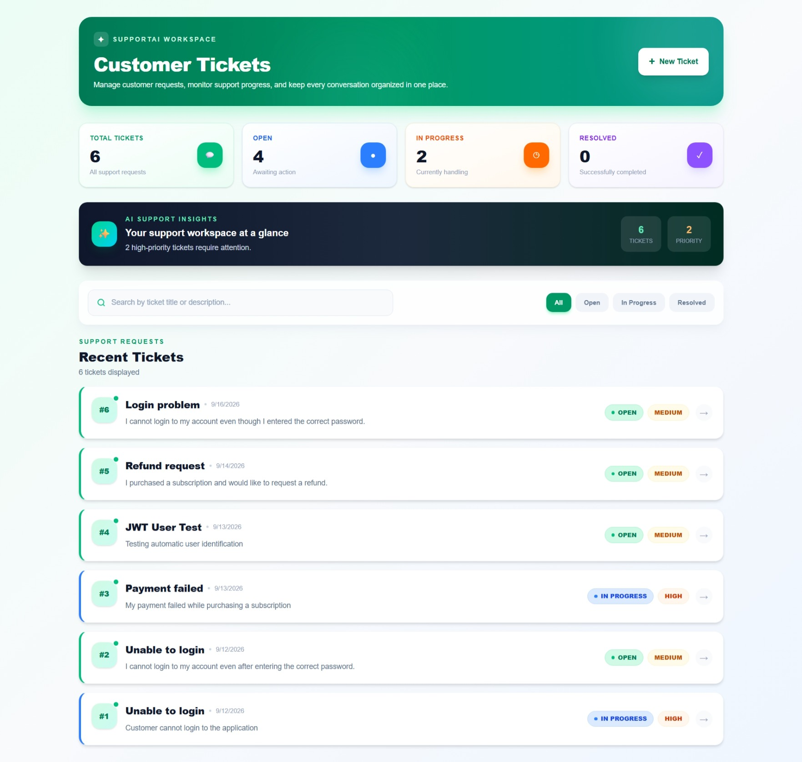
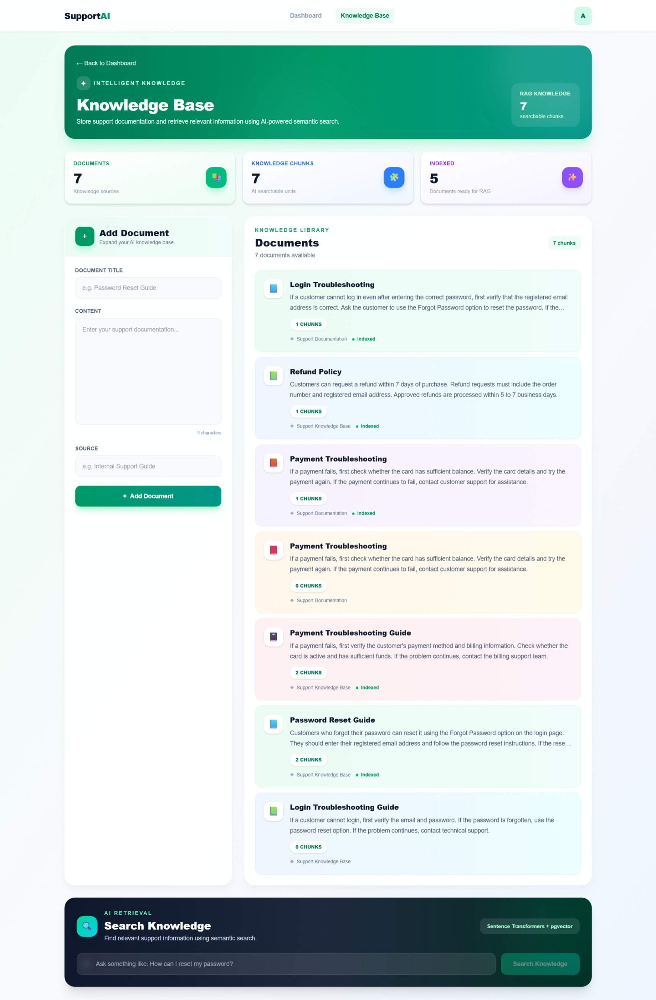

# SupportAI

AI-powered customer support management platform that combines ticket management, role-based access control, semantic search, RAG-based knowledge retrieval, and AI-assisted support workflows.

## Overview

SupportAI is a full-stack customer support platform designed to help support teams manage customer tickets and use AI-assisted workflows to improve support operations.

The platform consists of a Next.js frontend, NestJS backend, PostgreSQL database, and a dedicated Python FastAPI AI service.

## Architecture

```text
Next.js + React + TypeScript
            |
         REST API
            |
      NestJS + Prisma
            |
   PostgreSQL + pgvector
            |
      Python FastAPI
            |
     AI + RAG + Embeddings
```

## Key Features

- User registration and authentication
- JWT-based authentication
- Role-based access control
- Admin, Agent, and Customer roles
- Customer ticket creation and management
- Ticket status and priority management
- Ownership-based ticket access control
- Input validation and error handling
- AI ticket classification
- Sentiment analysis
- Ticket summarization
- AI-assisted response generation
- Knowledge base management
- Semantic search
- RAG-based knowledge retrieval
- Sentence Transformer embeddings
- PostgreSQL with pgvector
- Audit logging
- Swagger/OpenAPI API documentation

## AI & RAG

SupportAI uses a dedicated Python FastAPI service for AI-related operations.

The knowledge retrieval workflow includes:

1. Knowledge documents
2. Document chunking
3. Sentence Transformer embeddings
4. PostgreSQL + pgvector storage
5. Semantic similarity search
6. Relevant knowledge retrieval
7. Knowledge-supported response generation

The embedding model used for semantic search is:

`all-MiniLM-L6-v2`

The model generates 384-dimensional embeddings.

## Technology Stack

### Frontend

- Next.js
- React
- TypeScript
- Tailwind CSS

### Backend

- NestJS
- TypeScript
- Prisma
- REST APIs
- JWT
- Swagger / OpenAPI

### AI Service

- Python
- FastAPI
- Sentence Transformers
- PyTorch

### Database

- PostgreSQL
- pgvector

### Development Tools

- Git
- GitHub
- VS Code
- Google Colab

## Project Structure

```text
support-ai/
|
|-- frontend/
|   |-- src/
|   |   `-- app/
|   |       |-- knowledge/
|   |       |-- login/
|   |       |-- register/
|   |       `-- tickets/
|   `-- public/
|
|-- backend/
|   |-- src/
|   |   |-- auth/
|   |   |-- tickets/
|   |   |-- messages/
|   |   |-- knowledge/
|   |   |-- audit/
|   |   `-- prisma/
|   |
|   `-- prisma/
|       |-- schema.prisma
|       `-- migrations/
|
|-- ai-service/
|   |-- main.py
|   `-- embedding_test.py
|
|-- .gitignore
`-- README.md
```

## Running the Project

### 1. Clone the Repository

```bash
git clone https://github.com/aathil-yaseen/support-ai.git
cd support-ai
```

### 2. Backend Setup

```bash
cd backend
npm install
```

Create a `.env` file inside the `backend` directory:

```env
DATABASE_URL=
JWT_SECRET=
```

Generate the Prisma client:

```bash
npx prisma generate
```

Run database migrations:

```bash
npx prisma migrate dev
```

Start the backend:

```bash
npm run start:dev
```

Backend:

```text
http://localhost:4000
```

Swagger API Documentation:

```text
http://localhost:4000/api
```

### 3. AI Service Setup

Open a new terminal and navigate to the AI service:

```bash
cd ai-service
python -m venv venv
```

Activate the virtual environment and install the required Python dependencies.

Start the FastAPI service:

```bash
python -m uvicorn main:app --host 127.0.0.1 --port 8000
```

AI Service:

```text
http://localhost:8000
```

FastAPI Swagger Documentation:

```text
http://localhost:8000/docs
```

### 4. Frontend Setup

Open another terminal:

```bash
cd frontend
npm install
npm run dev
```

Frontend:

```text
http://localhost:3000
```

## API Services

| Service | Port | Purpose |
|---|---:|---|
| Frontend | 3000 | User interface |
| Backend | 4000 | REST API and business logic |
| AI Service | 8000 | AI and embedding operations |
| PostgreSQL | 5432 | Application database |

## Screenshots

### Dashboard


### Ticket Management


### Knowledge Base


## Security

Sensitive environment variables and local development files are excluded from version control.

The repository does not contain production credentials or local environment secrets.

Authentication and authorization are implemented using JWT and role-based access control.

## Testing

The application has been tested for:

- Authentication
- Role-based authorization
- Ticket ownership protection
- Input validation
- Invalid ticket IDs
- Missing authentication
- AI service failures
- AI classification
- Sentiment analysis
- Ticket summarization
- AI response generation
- Knowledge retrieval
- Semantic search
- RAG workflow
- Audit logging
- Error handling

## Project Status

Core development and functional testing are completed.

Current status:

- Core features implemented
- Authentication and authorization tested
- AI and RAG workflows tested
- Frontend and backend integrated
- GitHub documentation completed

## Author

**Aathil Yaseen**  
BSc (Hons) Electronics and Computer Science  
University of Kelaniya
